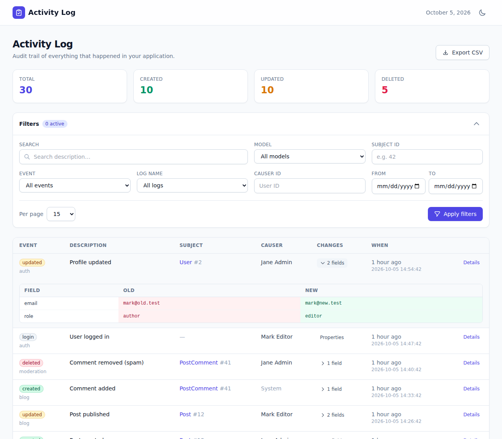

# Laravel Activity Log UI

**A beautiful, drop-in [Tailwind CSS](https://tailwindcss.com) dashboard for [Spatie Laravel Activitylog](https://spatie.be/docs/laravel-activitylog).** Browse, filter, diff, analyse and export the audit trail of your Laravel application — with analytics charts, a timeline, saved views, dark mode and a read-only JSON API. No build step, no Node, no npm.

[](https://packagist.org/packages/nsd7/laravel-activitylog-ui)
[](https://github.com/nowshad7/laravel-activitylog-ui/actions/workflows/tests.yml)
[](LICENSE)
[](https://packagist.org/packages/nsd7/laravel-activitylog-ui)
[](https://www.linkedin.com/in/rh-nowshad)



---

## Table of contents

- [Why this package](#why-this-package)
- [Features](#features)
- [Requirements](#requirements)
- [Quickstart](#quickstart)
- [Configuration](#configuration)
- [Analytics dashboard](#analytics-dashboard)
- [Timeline view](#timeline-view)
- [Saved views](#saved-views)
- [Exports](#exports-csv--json--excel--pdf)
- [Performance indexes](#performance-indexes)
- [Authorization & access control](#authorization--access-control)
- [JSON API](#json-api)
- [Localization](#localization)
- [Custom activity model / connection](#custom-activity-model--connection)
- [Testing](#testing)
- [Changelog](#changelog)
- [License](#license)

---

## Why this package

- **Zero build step.** Tailwind and Alpine.js are loaded at runtime — nothing to compile, no `npm install`.
- **Drop-in.** `composer require`, visit a URL, done. It reads your existing `activity_log` table.
- **Broad Laravel support.** Laravel **9, 10, 11 and 12** on PHP **8.0+** — not just the latest release.
- **Multi-database.** MySQL, MariaDB, PostgreSQL, SQLite and SQL Server, all tested. Search works everywhere (portable `LIKE` by default, optional MySQL fulltext).
- **Safe by default.** Authorization gate + optional allow-lists, `noindex` headers, and CSV exports hardened against spreadsheet formula injection.
- **Fully tested.** 80+ tests run against a Laravel 9→12 matrix on every push.

## Features

- 📋 **Activity list** with event badges, subject & causer links, relative timestamps and pagination.
- 🔍 **Inline change diff** — expand any row to see the old/new value of every changed attribute.
- 📄 **Detail page** per activity: field diff, custom properties, raw JSON, batch link and the **full history of the same record**.
- 🧰 **Rich filters** — free-text search, model, subject ID, event, log name, causer, batch and date range, with **quick date presets** (Today, Last 7/30 days, This month). Active filters show as removable chips and persist across pages.
- 💾 **Saved views** — save a filter set and recall it in one click, scoped per user.
- 📊 **Analytics dashboard** — activity over time, breakdown by event and log name, and top causers/subjects, rendered with Chart.js and honouring your current filters.
- 🕒 **Timeline view** — a day-grouped vertical timeline as an alternative to the table.
- 📈 **Statistics cards** (total / created / updated / deleted) for the current filter, with optional **live auto-refresh**.
- ⬇️ **Exports** — **CSV, JSON, Excel (XLSX) and PDF**. Streamed, row-capped, and injection-safe.
- 🔐 **Authorization gate**, configurable route prefix/domain/middleware, plus optional **user/role allow-lists**.
- 🔌 **Read-only JSON API** (opt-in) over the same filters — consume the log from a SPA, dashboard or automated agent.
- 🌍 **Localization** — publishable language files.
- 🌓 **Dark mode**, responsive layout, accessible markup.

## Requirements

- **PHP** `^8.0`
- **Laravel** `^9.0`, `^10.0`, `^11.0` or `^12.0`
- **spatie/laravel-activitylog** `^4.0`, already logging activity
- *Optional:* `maatwebsite/excel` for Excel export, `barryvdh/laravel-dompdf` for PDF export

## Quickstart

```bash
composer require nsd7/laravel-activitylog-ui
```

That's it — visit **`/admin/activity-log`** while logged in.

Make sure Spatie's `activity_log` table exists (see the [Spatie installation guide](https://spatie.be/docs/laravel-activitylog/v4/installation)). Optionally publish the config and run the extras:

```bash
# Publish the config file (optional)
php artisan vendor:publish --tag=activitylog-ui-config

# Publish the views to customise the UI (optional)
php artisan vendor:publish --tag=activitylog-ui-views

# Publish language files (optional)
php artisan vendor:publish --tag=activitylog-ui-lang

# Publish migrations for saved views + performance indexes (optional)
php artisan vendor:publish --tag=activitylog-ui-migrations
php artisan migrate
```

By default the dashboard is protected by the `web` and `auth` middleware. Define a gate (below) to restrict it further.

## Configuration

After publishing, everything lives in `config/activitylog-ui.php`:

| Key | Default | Description |
|---|---|---|
| `enabled` | `true` | Master switch. When off, no routes are registered. |
| `route.prefix` | `admin/activity-log` | URL prefix (env `ACTIVITYLOG_UI_PATH`). |
| `route.domain` | `null` | Optional domain (env `ACTIVITYLOG_UI_DOMAIN`). |
| `route.middleware` | `['web', 'auth']` | Middleware applied to all routes. |
| `gate` | `viewActivityLogUi` | Gate checked when defined. |
| `access.allowed_users` | `[]` | Allow-list of user ids or emails (enforced when non-empty). |
| `access.allowed_roles` | `[]` | Allow-list of role names (enforced when non-empty). |
| `features.analytics` | `true` | Analytics dashboard + data endpoint. |
| `features.timeline` | `true` | Timeline view toggle. |
| `features.saved_views` | `true` | Saved views (needs the migration). |
| `features.live_counts` | `false` | Background-refresh the statistics total. |
| `features.api` | `false` | Read-only JSON API. |
| `per_page` / `per_page_options` | `15` / `[10,15,25,50,100]` | Pagination. |
| `search_driver` | `like` | `like` (portable) or `fulltext` (MySQL/MariaDB). |
| `causer_display_attributes` | `['name','full_name','username','email']` | First non-empty wins. |
| `date_format` | `Y-m-d H:i:s` | Timestamp display format. |
| `show_stats` | `true` | Show the statistics cards. |
| `analytics.cache_ttl` | `3600` | Seconds to cache the analytics payload (`0` = off). |
| `analytics.range_days` | `30` | Default window of the "activity over time" chart. |
| `live_counts.poll_interval` | `15` | Seconds between live-count refreshes. |
| `saved_views.max_per_user` | `50` | Cap per user. |
| `export.enabled` | `true` | Allow exports. |
| `export.limit` | `10000` | Max rows written per export. |
| `export.formats` | `['csv','json','xlsx','pdf']` | Formats offered in the UI. |

## Analytics dashboard

Open the **Analytics** tab for charts computed from the currently filtered logs: activity over time, counts by event and by log name, and the top causers and subjects. The payload is cached per filter set (`analytics.cache_ttl`) and the date grouping is portable across MySQL, PostgreSQL, SQLite and SQL Server. Disable with `features.analytics => false`.

## Timeline view

The **Timeline** tab renders the same filtered activities as a day-grouped vertical timeline — handy for scanning what happened and when. Disable with `features.timeline => false`.

## Saved views

Save the current filter set a name and recall it with one click later. Views are scoped to the authenticated user. Run the published migration to create the `activitylog_ui_saved_views` table; until then the feature degrades gracefully and simply stays hidden.

## Exports (CSV / JSON / Excel / PDF)

Export the **currently filtered** result in any configured format from the Export menu:

- **CSV** and **JSON** work out of the box and are streamed.
- **Excel (XLSX)** uses `maatwebsite/excel` when installed, and **falls back to CSV** when it isn't.
- **PDF** uses `barryvdh/laravel-dompdf` when installed, and **falls back to JSON** when it isn't.

All exports are capped at `export.limit` rows and string values are neutralised against CSV/formula injection.

## Performance indexes

For large tables, publish and run the optional index migration (included in `activitylog-ui-migrations`). It adds indexes on `event`, `created_at` and a composite `(log_name, created_at)` on top of Spatie's defaults, which speeds up filtering and ordering. Building indexes can briefly lock the table, so run it in a maintenance window.

## Authorization & access control

Access is layered:

1. **Route middleware** (`web`, `auth` by default).
2. **Gate** — if a gate named by `gate` is defined, it must pass:

   ```php
   use Illuminate\Support\Facades\Gate;

   Gate::define('viewActivityLogUi', fn ($user) => $user->is_admin);
   ```

3. **Allow-lists** (optional) — set `access.allowed_users` (ids or emails) and/or `access.allowed_roles` (works with `hasRole()`, `getRoleNames()`, e.g. spatie/laravel-permission). Each list is only enforced when non-empty, so the defaults change nothing.

## JSON API

Enable `features.api => true` for a read-only API under your prefix:

```
GET  {prefix}/api/activities           # paginated, accepts the same filters as the UI
GET  {prefix}/api/activities/{id}       # a single activity with its change diff
```

It honours the same authorization as the UI and is ideal for SPAs, dashboards and automated agents.

## Localization

Publish the language files with `--tag=activitylog-ui-lang` and translate `lang/vendor/activitylog-ui/{locale}/messages.php`. The UI uses your app locale automatically.

## Custom activity model / connection

The UI resolves the activity model through Spatie, so a custom model or database connection configured in `config/activitylog.php` (`activity_model`) is picked up automatically — including a custom table name.

## Testing

```bash
composer install
composer test
```

The suite runs against a Laravel 9→12 / PHP 8.1→8.4 matrix in CI.

## Changelog

See [CHANGELOG.md](CHANGELOG.md) for what changed in each release.

## License

The MIT License (MIT). See [LICENSE](LICENSE).
